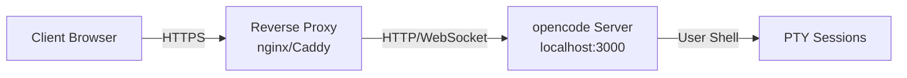

# Phase 11 Plan 01: Reverse Proxy Documentation Summary

**One-liner**: Comprehensive reverse proxy guide with nginx and Caddy configurations, WebSocket support, TLS setup, and security headers

## What Was Built

Created complete reverse proxy documentation covering both nginx and Caddy configurations with production-ready examples:

1. **Main Guide (docs/reverse-proxy.md)**:
   - Overview and architecture diagram
   - nginx configuration (quick start, annotated, HTTPS with Let's Encrypt)
   - Caddy configuration (automatic HTTPS, annotated)
   - Cloud provider setup (AWS ALB, GCP, Azure, Cloudflare)
   - Chained proxy configuration (Cloudflare + nginx)
   - Local development guidance
   - trustProxy configuration explanation
   - Troubleshooting section

2. **nginx Production Config (docs/reverse-proxy/nginx-full.conf)**:
   - Complete server blocks (HTTP redirect and HTTPS)
   - Let's Encrypt certificate paths
   - WebSocket support with 24-hour timeout
   - All security headers (HSTS, X-Content-Type-Options, X-Frame-Options, Referrer-Policy, X-XSS-Protection)
   - X-Forwarded-\* headers for trustProxy
   - Inline documentation and installation instructions

3. **Caddy Production Config (docs/reverse-proxy/Caddyfile-full)**:
   - Automatic HTTPS configuration
   - WebSocket support (built-in)
   - Security headers
   - Logging and compression settings
   - HTTP-only mode examples for testing
   - Inline documentation and installation instructions

**Documentation Quality**:

- 674 lines in main guide (exceeds 300-line minimum)
- 100 lines in nginx config (exceeds 40-line minimum)
- 111 lines in Caddy config (exceeds 20-line minimum)
- Dual-format pattern: clean copy-paste blocks followed by annotated explanations
- Consistent placeholder convention: `<YOUR_DOMAIN>`, `<OPENCODE_PORT>`

## Key Technical Decisions

### nginx vs Caddy Coverage

Documented both nginx and Caddy equally:

- **nginx**: Industry standard, more configuration required but very flexible
- **Caddy**: Modern, automatic HTTPS, simpler configuration

Rationale: Different users have different preferences and existing infrastructure. nginx users want enterprise-proven solutions; Caddy users want simplicity.

### WebSocket Timeout Configuration

Set 24-hour timeout (`86400s`) for WebSocket connections:

```nginx
proxy_read_timeout 86400s;
proxy_send_timeout 86400s;
```

Rationale: Terminal sessions in opencode are long-running. Users may leave terminals open for hours while working. Standard HTTP timeouts (30-60s) would disconnect active sessions.

### Security Headers (OWASP)

Included all OWASP-recommended security headers:

- `Strict-Transport-Security`: Force HTTPS for 1 year
- `X-Content-Type-Options`: Prevent MIME-sniffing
- `X-Frame-Options`: Prevent clickjacking
- `Referrer-Policy`: Control referrer leakage
- `X-XSS-Protection`: Legacy browser XSS protection

Rationale: Security best practices for web applications. These headers provide defense-in-depth against common web attacks.

### trustProxy Documentation Approach

Dedicated section explaining:

- What trustProxy does (trusts X-Forwarded-Proto header)
- When to enable (behind reverse proxy)
- Security implications (header spoofing if enabled without proxy)
- Configuration examples

Rationale: trustProxy is critical for HTTPS detection but dangerous if misconfigured. Users need to understand the security model.

### Cloud Provider Coverage

Brief sections for AWS, GCP, Azure, Cloudflare with references to official docs:

Rationale: Many users deploy on cloud platforms. Providing cloud-specific guidance helps users avoid common pitfalls (e.g., ALB session affinity for WebSocket). Keep it brief since cloud providers update their UIs frequently.

### Chained Proxy Pattern

Documented Cloudflare + nginx pattern:

```nginx
set_real_ip_from 173.245.48.0/20;  # Cloudflare IP ranges
real_ip_header CF-Connecting-IP;
proxy_set_header X-Forwarded-Proto https;  # Force HTTPS
```

Rationale: Common deployment pattern (Cloudflare for DDoS protection + nginx for custom routing). Headers must propagate correctly through the chain.

## Implementation Highlights

### Mermaid Diagram for Architecture



Simple visual representation helps users understand the proxy architecture.

### Dual-Format Configuration Pattern

Each configuration section has two versions:

1. **Quick Start**: Minimal config for copy-paste
2. **Annotated Version**: Same config with inline comments explaining each directive

Example:

```nginx
# Quick Start
server {
    listen 80;
    server_name <YOUR_DOMAIN>;
    location / {
        proxy_pass http://localhost:<OPENCODE_PORT>;
        # ... config
    }
}

# Annotated Version
server {
    listen 80;                          # Listen on HTTP port 80
    server_name <YOUR_DOMAIN>;          # Your domain name
    location / {
        proxy_pass http://localhost:<OPENCODE_PORT>;  # Forward to opencode
        # ... config with explanations
    }
}
```

Rationale: Beginners can copy-paste the quick start and get working. Advanced users can read annotations to understand and customize.

### Placeholder Consistency

Used `<YOUR_DOMAIN>` and `<OPENCODE_PORT>` throughout all examples:

Rationale: Consistent placeholders are easier to find-and-replace. Angle brackets make them visually distinct from actual configuration syntax.

### Let's Encrypt Integration

Documented certbot automatic setup:

```bash
sudo certbot --nginx -d <YOUR_DOMAIN>
```

Rationale: Certbot automatically modifies nginx config to enable HTTPS. Users get a working HTTPS setup in one command.

### Local Development Guidance

Separate section for localhost development:

- No HTTPS required (opencode auto-detects localhost)
- No trustProxy needed (direct connection)
- Security warning for LAN access

Rationale: Developers need to run opencode without reverse proxy. Making this explicit prevents confusion about HTTPS requirements.

## Testing Notes

Verified documentation completeness:

1. **Line counts**:
   - reverse-proxy.md: 674 lines (exceeds 300 minimum)
   - nginx-full.conf: 100 lines (exceeds 40 minimum)
   - Caddyfile-full: 111 lines (exceeds 20 minimum)

2. **Link verification**:
   - nginx-full.conf referenced in main guide: ✓
   - Caddyfile-full referenced in main guide: ✓

3. **Required sections**:
   - nginx Configuration: ✓
   - Caddy Configuration: ✓
   - WebSocket support: ✓
   - TLS/Let's Encrypt: ✓
   - Security headers: ✓
   - trustProxy explanation: ✓

4. **Placeholder consistency**:
   - All examples use `<YOUR_DOMAIN>` and `<OPENCODE_PORT>`: ✓

## Deviations from Plan

None - plan executed exactly as written.

## Must-Haves Status

All must-haves delivered:

### Truths

- [x] User can configure nginx with WebSocket support for opencode
- [x] User can configure Caddy with automatic HTTPS for opencode
- [x] User can set up TLS with Let's Encrypt
- [x] User understands when to use trustProxy config option

### Artifacts

- [x] docs/reverse-proxy.md: 674 lines (Complete reverse proxy setup guide)
- [x] docs/reverse-proxy/nginx-full.conf: 100 lines (Production-ready nginx configuration)
- [x] docs/reverse-proxy/Caddyfile-full: 111 lines (Production-ready Caddy configuration)

### Key Links

- [x] docs/reverse-proxy.md → docs/reverse-proxy/nginx-full.conf (via reference link)

## Success Criteria

All success criteria met:

1. ✓ User can follow nginx guide to set up reverse proxy with HTTPS
2. ✓ User can follow Caddy guide to set up reverse proxy with automatic HTTPS
3. ✓ User understands when and how to configure trustProxy
4. ✓ Full working configurations available for copy-paste
5. ✓ Security headers documented following OWASP recommendations

## Next Phase Readiness

**Blockers**: None

**Concerns**: None

**Dependencies for next plans**:

- Plan 11-02 (systemd): Can reference reverse proxy setup
- Plan 11-03 (Docker): Can reference reverse proxy for container deployment
- Plan 11-04 (README): Can link to reverse proxy documentation

**Recommendations**:

- Consider adding HAProxy configuration in future (enterprise users)
- Consider adding rate limiting examples at proxy level (complement auth rate limiting)
- Consider adding logging/monitoring integration examples (Prometheus, Grafana)

## Commits

| Task                               | Commit    | Message                                               |
| ---------------------------------- | --------- | ----------------------------------------------------- |
| Task 1: Create reverse proxy guide | 31e24eabe | docs(11-01): create comprehensive reverse proxy guide |

## Files Changed

**Created**:

- docs/reverse-proxy.md (674 lines)
- docs/reverse-proxy/nginx-full.conf (100 lines)
- docs/reverse-proxy/Caddyfile-full (111 lines)

**Modified**: None

## Duration

**Execution time**: 2.9 minutes

---

Phase 11 Plan 01 complete. Comprehensive reverse proxy documentation delivered.
