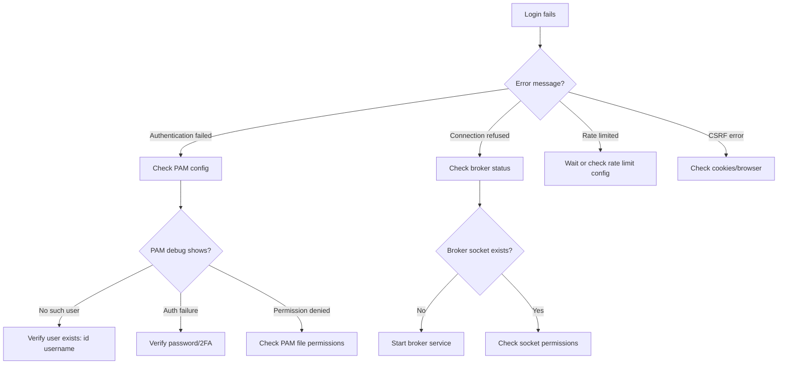
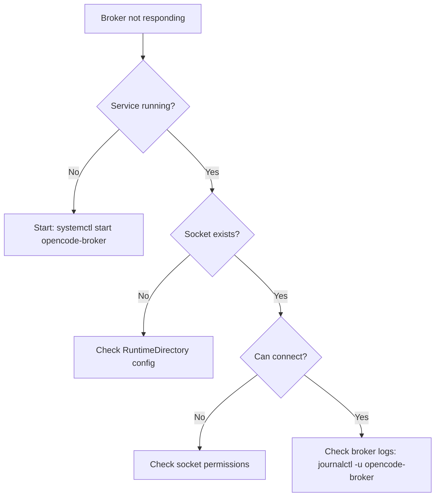
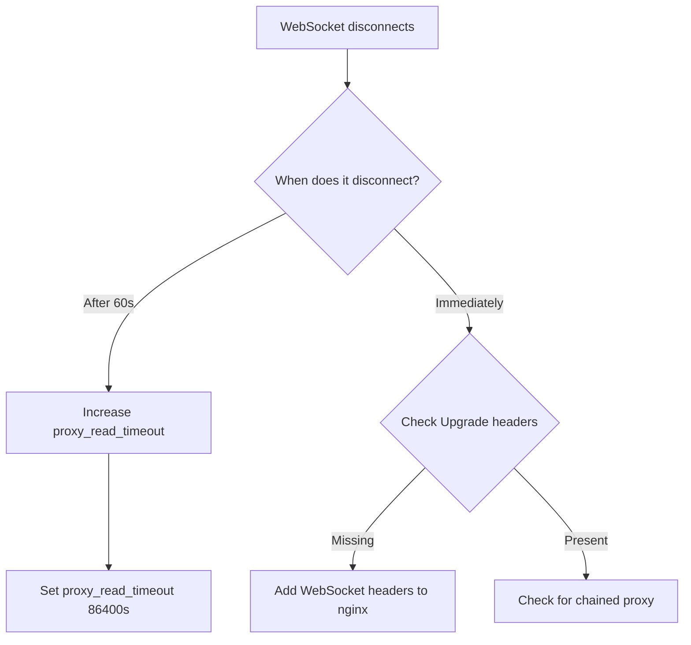

<objective>
Create comprehensive troubleshooting guide with Mermaid flowcharts for diagnostic workflows and detailed solutions for common issues.

Purpose: Users encountering auth issues need systematic guidance to diagnose and resolve problems.
Output: docs/troubleshooting.md with decision trees, common errors, and solutions.
</objective>

<execution_context>
@~/.claude/get-shit-done/workflows/execute-plan.md
@~/.claude/get-shit-done/templates/summary.md
</execution_context>

<context>
@.planning/PROJECT.md
@.planning/ROADMAP.md
@.planning/STATE.md
@.planning/phases/11-documentation/11-CONTEXT.md
@.planning/phases/11-documentation/11-RESEARCH.md
</context>

<tasks>

<task type="auto">
  <name>Task 1: Create troubleshooting guide with flowcharts</name>
  <files>docs/troubleshooting.md</files>
  <action>
Create docs/troubleshooting.md with comprehensive troubleshooting guide:

**Overview**

- How to approach auth troubleshooting
- Key log locations (/var/log/auth.log, journalctl)

**Diagnostic Flowchart: Login Fails**



**Diagnostic Flowchart: Broker Issues**



**Diagnostic Flowchart: WebSocket Issues**



**Common Issues and Solutions**

**1. "Authentication failed" - Generic Error**

- Symptom: Login shows generic error, no specific message
- Cause: PAM authentication failed (by design, no user enumeration)
- Debug steps:
  1. Enable PAM debug logging (add debug to pam_unix.so)
  2. Check /var/log/auth.log or journalctl
  3. Look for specific PAM error
- Common causes:
  - Wrong password
  - User doesn't exist
  - PAM file misconfigured
  - 2FA code wrong or expired

**2. "Connection refused" - Broker Not Running**

- Symptom: Login fails immediately with connection error
- Cause: opencode-broker not running or socket not created
- Debug steps:
  1. Check service: `systemctl status opencode-broker`
  2. Check socket: `ls -la /run/opencode/broker.sock`
  3. Check logs: `journalctl -u opencode-broker -n 50`
- Solutions:
  - Start service: `systemctl start opencode-broker`
  - If socket missing: check RuntimeDirectory in service file

**3. "502 Bad Gateway" - nginx Can't Connect to opencode**

- Symptom: nginx returns 502 error
- Cause: nginx can't reach opencode backend
- Debug steps:
  1. Check opencode is running: `curl localhost:3000`
  2. Check nginx error log: `/var/log/nginx/error.log`
  3. If "Permission denied": SELinux blocking
- Solutions:
  - SELinux: `setsebool -P httpd_can_network_connect 1`
  - AppArmor: Check nginx profile

**4. WebSocket Drops After 60 Seconds**

- Symptom: Terminal disconnects after exactly 60s of inactivity
- Cause: nginx default proxy_read_timeout is 60s
- Solution:
  ```nginx
  proxy_read_timeout 86400s;
  proxy_send_timeout 86400s;
  ```

**5. Rate Limited When You Shouldn't Be**

- Symptom: "Too many attempts" even on first try
- Cause: IP being reused or X-Forwarded-For not trusted
- Debug steps:
  1. Check if behind proxy without trustProxy
  2. Check rate limit logs
- Solutions:
  - Enable trustProxy in opencode.json if behind reverse proxy
  - Clear rate limit (restart opencode or wait for window)

**6. CSRF Token Error**

- Symptom: "Invalid CSRF token" on form submit
- Cause: Cookie not set or mismatch
- Debug steps:
  1. Check browser cookies (should have opencode-csrf)
  2. Check if cookies being cleared
  3. Check for double-submit cookie mismatch
- Solutions:
  - Clear cookies and retry
  - Check SameSite cookie settings match your domain setup
  - For cross-origin: check CORS and cookie settings

**7. 2FA Code Always Invalid**

- Symptom: TOTP codes never accepted
- Cause: Time sync issue or wrong PAM service
- Debug steps:
  1. Check server time: `date`
  2. Check time sync: `timedatectl status`
  3. Verify PAM config uses opencode-otp service for 2FA
- Solutions:
  - Sync time: `timedatectl set-ntp true`
  - Check authenticator app time sync
  - Regenerate secret if clock was significantly off

**8. SELinux Blocking nginx**

- Symptom: 502 Bad Gateway, "Permission denied" in nginx error.log
- Cause: SELinux httpd_t can't make network connections
- Debug steps:
  1. Check SELinux: `getenforce`
  2. Check audit log: `ausearch -m avc -ts recent`
- Solution:
  ```bash
  sudo setsebool -P httpd_can_network_connect 1
  ```

**9. macOS PAM "Operation not permitted"**

- Symptom: PAM operations fail on macOS Monterey+
- Cause: TCC restrictions on /etc/pam.d
- Solutions:
  - Grant Terminal Full Disk Access in System Preferences
  - Use privileged helper or sudo for PAM operations

**Enabling PAM Debug Logging**

```bash
# Linux: Add debug flag to PAM module
# In /etc/pam.d/opencode:
auth required pam_unix.so debug

# Check logs:
sudo tail -f /var/log/auth.log        # Debian/Ubuntu
sudo journalctl -f -t opencode-broker  # systemd
sudo tail -f /var/log/secure          # RHEL/CentOS

# Disable rate limiting in rsyslog (for verbose debug):
# Add to /etc/rsyslog.conf:
$SystemLogRateLimitInterval 0
$SystemLogRateLimitBurst 0
sudo systemctl restart rsyslog
```

**Checking Broker Status**

```bash
# Linux (systemd)
systemctl status opencode-broker
journalctl -u opencode-broker -n 100

# macOS (launchd)
sudo launchctl list | grep opencode
sudo cat /var/log/opencode-broker.log

# Check socket
ls -la /run/opencode/broker.sock  # Linux
ls -la /var/run/opencode/broker.sock  # Alternative
```

**Getting Help**

- Link to GitHub issues for bug reports
- Link to Discord for community help
- What to include in bug reports (logs, config, versions)

Include Mermaid flowcharts for visual diagnostic paths.
Use consistent error -> cause -> debug -> solution format.
Cross-reference to pam-config.md and reverse-proxy.md where relevant.
</action>
<verify> - docs/troubleshooting.md exists - At least 3 Mermaid flowcharts present - Common issues section with numbered problems - Each issue has symptom, cause, debug steps, solution - PAM debug logging instructions included - Broker status checking documented - SELinux and macOS issues covered
</verify>
<done> - Troubleshooting guide with Mermaid flowcharts for diagnosis - Common issues documented with consistent format - PAM debug logging instructions - Broker status checking documented - Platform-specific issues (SELinux, macOS TCC) covered - Cross-references to other docs
</done>
</task>

</tasks>

<verification>
- [ ] docs/troubleshooting.md created
- [ ] Mermaid flowcharts render correctly
- [ ] Common issues documented (8+ issues)
- [ ] Each issue has symptom/cause/solution format
- [ ] PAM debug logging documented
- [ ] Broker troubleshooting documented
- [ ] nginx/WebSocket issues covered
- [ ] Platform-specific issues covered
</verification>

<success_criteria>

1. User can follow flowchart to diagnose login failures
2. User can enable PAM debug logging and read output
3. User can check and troubleshoot broker status
4. User can resolve common nginx/WebSocket issues
5. User can handle SELinux and macOS-specific problems
   </success_criteria>

<output>
After completion, create `.planning/phases/11-documentation/11-03-SUMMARY.md`
</output>
