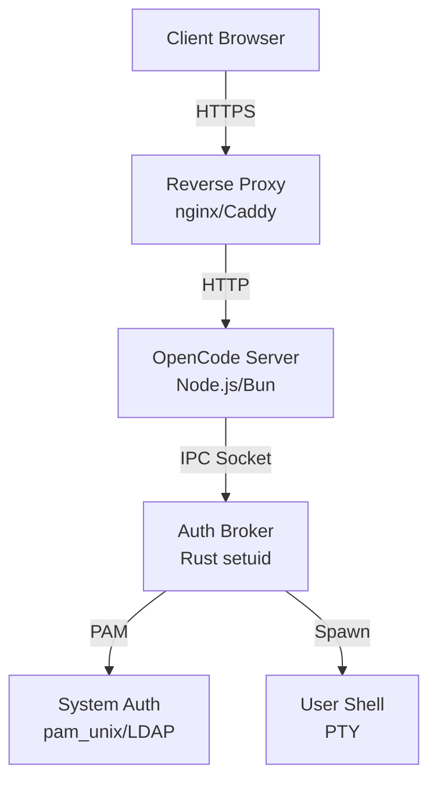

# OpenCode Authentication Documentation

Documentation for deploying OpenCode with system authentication enabled.

## Quick Start

New to auth-enabled OpenCode? Follow this path:

1. **Install OpenCode** (if not already done)

   ```bash
   npm i -g opencode-ai@latest
   ```

2. **Set up reverse proxy** for HTTPS/TLS
   - See [reverse-proxy.md](reverse-proxy.md) for nginx or Caddy configuration

3. **Configure PAM authentication**
   - See [pam-config.md](pam-config.md) for authentication setup

4. **Enable auth in OpenCode config**

   ```json
   {
     "auth": {
       "enabled": true
     }
   }
   ```

5. **Start OpenCode** and access via your domain
   ```bash
   opencode
   ```

For issues, consult the [troubleshooting guide](troubleshooting.md).

## Documentation

### Deployment

**[Reverse Proxy Setup](reverse-proxy.md)**
Complete guide to configuring nginx or Caddy for HTTPS/TLS termination, WebSocket support, and security headers. Includes production-ready configurations and cloud provider setup.

**Topics covered:**

- nginx and Caddy configuration
- Automatic HTTPS with Let's Encrypt
- WebSocket proxying for terminal sessions
- Security headers and best practices
- Cloud provider integration (AWS, GCP, Azure)
- Development vs production setups

**[PAM Configuration](pam-config.md)**
System authentication setup for password login, two-factor authentication (2FA), and LDAP/Active Directory integration.

**Topics covered:**

- Basic PAM setup (Linux and macOS)
- Two-factor authentication with Google Authenticator
- LDAP/Active Directory integration
- Account lockout policies
- Platform-specific configurations
- Security best practices

### Reference

**[Troubleshooting Guide](troubleshooting.md)**
Common issues and solutions for authentication problems. Includes diagnostic flowcharts and debugging procedures.

**Topics covered:**

- Login failures (credentials, permissions, user lookup)
- Broker connection issues
- WebSocket connectivity problems
- PAM debug logging
- Platform-specific troubleshooting

**[Docker Installation Guide](docker-install-fork.md)**
How to install the opencode fork (with authentication) from source in Dockerfiles.

**Topics covered:**

- Building opencode from source in Docker
- Installing from GitHub fork (pRizz/opencode)
- Integration with opencode-cloud Dockerfile
- Build optimization and caching strategies

### Configuration Reference

**Example configurations:**

- [nginx-full.conf](reverse-proxy/nginx-full.conf) - Production nginx configuration
- [Caddyfile-full](reverse-proxy/Caddyfile-full) - Production Caddy configuration

**Service files:**

- `packages/opencode-broker/service/opencode.pam` - Linux PAM config
- `packages/opencode-broker/service/opencode.pam.macos` - macOS PAM config
- `packages/opencode-broker/service/opencode-broker.service` - systemd service
- `packages/opencode-broker/service/com.opencode.broker.plist` - launchd service

## Architecture Overview

OpenCode authentication uses a multi-component architecture:



**Components:**

1. **Reverse Proxy** - Handles HTTPS/TLS, forwards to OpenCode server
2. **OpenCode Server** - Web application, session management, UI
3. **Auth Broker** - Setuid root process for PAM authentication and user impersonation
4. **System Auth** - PAM modules (local users, LDAP, 2FA)
5. **User Shell** - PTY sessions running as authenticated user

**Security model:**

- Reverse proxy enforces HTTPS (production)
- OpenCode server manages sessions, CSRF tokens, rate limiting
- Auth broker runs as setuid root, drops privileges after user spawn
- PAM provides pluggable authentication (passwords, 2FA, LDAP)

## Security Features

**Built-in protections:**

- ✅ HTTPS enforcement with certificate validation
- ✅ CSRF protection via double-submit cookie pattern
- ✅ Rate limiting (5 attempts per 15 minutes)
- ✅ Secure session cookies (httpOnly, SameSite)
- ✅ Two-factor authentication support
- ✅ Device trust for 2FA
- ✅ Session timeout and "remember me" options
- ✅ Password redaction in logs

**Best practices:**

- Use a reverse proxy for TLS termination
- Configure security headers (CSP, HSTS, X-Frame-Options)
- Enable 2FA for sensitive accounts
- Use strong PAM modules (pam_pwquality for password strength)
- Monitor auth logs for suspicious activity
- Set appropriate session timeouts

## Related Projects

**[opencode-cloud](https://github.com/pRizz/opencode-cloud)**
Systemd service manager and deployment automation for OpenCode.

## Getting Help

**Issue checklist:**

1. Check the [troubleshooting guide](troubleshooting.md)
2. Review logs (auth.log, systemctl status, journalctl)
3. Verify PAM configuration
4. Test broker connectivity

**Where to ask:**

- [GitHub Issues](https://github.com/anomalyco/opencode/issues) - Bug reports and feature requests
- [Discord](https://discord.gg/opencode) - Community support
- [Discussions](https://github.com/anomalyco/opencode/discussions) - General questions

When reporting issues, include:

- OpenCode version (`opencode --version`)
- Operating system and version
- Reverse proxy type (nginx/Caddy) and version
- Relevant log excerpts (redact sensitive info)
- Steps to reproduce

## Contributing

Found an error in the docs? Have a suggestion?

1. Check [CONTRIBUTING.md](../CONTRIBUTING.md) for guidelines
2. Open an issue or pull request
3. Documentation is in `/docs`

---

**Navigation:** [Main README](../README.md) | [Reverse Proxy](reverse-proxy.md) | [PAM Config](pam-config.md) | [Troubleshooting](troubleshooting.md) | [Docker Install](docker-install-fork.md)
