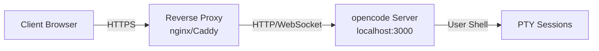

# Reverse Proxy Setup Guide

This guide covers setting up a reverse proxy for opencode with HTTPS/TLS termination, WebSocket support, and security headers.

## Table of Contents

- [Overview](#overview)
- [nginx Configuration](#nginx-configuration)
- [Caddy Configuration](#caddy-configuration)
- [Cloud Providers](#cloud-providers)
- [Chained Proxies](#chained-proxies)
- [Local Development](#local-development)
- [trustProxy Configuration](#trustproxy-configuration)
- [Reference](#reference)

## Overview

### Why Use a Reverse Proxy?

A reverse proxy sits between clients and your opencode instance, providing:

- **TLS Termination**: HTTPS encryption with automatic certificate renewal
- **Load Balancing**: Distribute traffic across multiple instances
- **Security**: Additional firewall layer, rate limiting, header management
- **Caching**: Static asset caching to reduce server load
- **Centralized Management**: Single entry point for multiple services

### Architecture



The reverse proxy:

1. Accepts incoming HTTPS connections from clients
2. Terminates TLS encryption
3. Forwards requests to opencode over HTTP (localhost only)
4. Upgrades WebSocket connections for terminal sessions
5. Adds security headers to all responses

## nginx Configuration

nginx is a widely-used, high-performance web server and reverse proxy.

### Prerequisites

```bash
# Install nginx
# Ubuntu/Debian
sudo apt-get update && sudo apt-get install nginx

# macOS
brew install nginx

# Verify installation
nginx -v
```

### Quick Start

**Minimal working configuration** for opencode reverse proxy:

```nginx
server {
    listen 80;
    server_name <YOUR_DOMAIN>;

    location / {
        proxy_pass http://localhost:<OPENCODE_PORT>;
        proxy_http_version 1.1;
        proxy_set_header Upgrade $http_upgrade;
        proxy_set_header Connection "upgrade";
        proxy_set_header Host $host;
        proxy_set_header X-Real-IP $remote_addr;
        proxy_set_header X-Forwarded-For $proxy_add_x_forwarded_for;
        proxy_set_header X-Forwarded-Proto $scheme;
        proxy_read_timeout 86400s;
    }
}
```

Replace:

- `<YOUR_DOMAIN>` with your domain (e.g., `opencode.example.com`)
- `<OPENCODE_PORT>` with your opencode port (default: `3000`)

Save to `/etc/nginx/sites-available/opencode` and enable:

```bash
sudo ln -s /etc/nginx/sites-available/opencode /etc/nginx/sites-enabled/
sudo nginx -t
sudo systemctl reload nginx
```

### Annotated Configuration

Here's the same configuration with explanations:

```nginx
server {
    listen 80;                          # Listen on HTTP port 80
    server_name <YOUR_DOMAIN>;          # Your domain name

    location / {
        # Forward all requests to opencode
        proxy_pass http://localhost:<OPENCODE_PORT>;

        # WebSocket Support
        proxy_http_version 1.1;                         # Required for WebSocket
        proxy_set_header Upgrade $http_upgrade;        # Pass WebSocket upgrade header
        proxy_set_header Connection "upgrade";         # Set connection upgrade header

        # Standard Proxy Headers
        proxy_set_header Host $host;                           # Preserve original host
        proxy_set_header X-Real-IP $remote_addr;               # Client IP address
        proxy_set_header X-Forwarded-For $proxy_add_x_forwarded_for;  # Client IP chain
        proxy_set_header X-Forwarded-Proto $scheme;            # Original protocol (http/https)

        # WebSocket Timeout
        proxy_read_timeout 86400s;                      # 24 hours (prevents disconnect)
    }
}
```

**Key Headers Explained:**

- `Upgrade` + `Connection`: Enable WebSocket protocol upgrade
- `X-Real-IP`: Client's actual IP address (not proxy IP)
- `X-Forwarded-For`: Full chain of proxy IPs (for logging)
- `X-Forwarded-Proto`: Original protocol, critical for `trustProxy` config

### HTTPS with Let's Encrypt

Use [certbot](https://certbot.eff.org/) for automatic HTTPS setup:

```bash
# Install certbot
# Ubuntu/Debian
sudo apt-get install certbot python3-certbot-nginx

# macOS
brew install certbot

# Obtain certificate and auto-configure nginx
sudo certbot --nginx -d <YOUR_DOMAIN>
```

Certbot will:

1. Request a certificate from Let's Encrypt
2. Modify your nginx config to enable HTTPS
3. Set up automatic renewal via cron/systemd timer

Your config will be updated to:

```nginx
server {
    listen 80;
    server_name <YOUR_DOMAIN>;
    return 301 https://$server_name$request_uri;  # Redirect HTTP to HTTPS
}

server {
    listen 443 ssl http2;
    server_name <YOUR_DOMAIN>;

    ssl_certificate /etc/letsencrypt/live/<YOUR_DOMAIN>/fullchain.pem;
    ssl_certificate_key /etc/letsencrypt/live/<YOUR_DOMAIN>/privkey.pem;
    include /etc/letsencrypt/options-ssl-nginx.conf;
    ssl_dhparam /etc/letsencrypt/ssl-dhparams.pem;

    location / {
        proxy_pass http://localhost:<OPENCODE_PORT>;
        # ... rest of proxy config
    }
}
```

**Manual certificate renewal** (usually automatic):

```bash
sudo certbot renew --dry-run  # Test renewal
sudo certbot renew            # Force renewal if needed
```

### Security Headers

Add security headers recommended by [OWASP](https://owasp.org/www-project-secure-headers/):

```nginx
server {
    # ... existing config ...

    location / {
        # ... existing proxy config ...

        # Security Headers
        add_header Strict-Transport-Security "max-age=31536000; includeSubDomains" always;
        add_header X-Content-Type-Options "nosniff" always;
        add_header X-Frame-Options "SAMEORIGIN" always;
        add_header Referrer-Policy "strict-origin-when-cross-origin" always;
        add_header X-XSS-Protection "1; mode=block" always;
    }
}
```

**Header Explanations:**

- `Strict-Transport-Security` (HSTS): Force HTTPS for 1 year
- `X-Content-Type-Options`: Prevent MIME-sniffing attacks
- `X-Frame-Options`: Prevent clickjacking (only allow same-origin iframes)
- `Referrer-Policy`: Control referrer information leakage
- `X-XSS-Protection`: Enable browser XSS filters (legacy browsers)

### Full Production Configuration

For the complete production-ready nginx configuration with all features:

See: [docs/reverse-proxy/nginx-full.conf](reverse-proxy/nginx-full.conf)

## Caddy Configuration

Caddy is a modern web server with automatic HTTPS built-in.

### Prerequisites

```bash
# Install Caddy
# Ubuntu/Debian
sudo apt install -y debian-keyring debian-archive-keyring apt-transport-https curl
curl -1sLf 'https://dl.cloudsmith.io/public/caddy/stable/gpg.key' | sudo gpg --dearmor -o /usr/share/keyrings/caddy-stable-archive-keyring.gpg
curl -1sLf 'https://dl.cloudsmith.io/public/caddy/stable/debian.deb.txt' | sudo tee /etc/apt/sources.list.d/caddy-stable.list
sudo apt update
sudo apt install caddy

# macOS
brew install caddy

# Verify installation
caddy version
```

### Quick Start

**Minimal working Caddyfile** for opencode:

```caddy
<YOUR_DOMAIN> {
    reverse_proxy localhost:<OPENCODE_PORT>
}
```

That's it! Caddy automatically:

- Obtains TLS certificates from Let's Encrypt
- Redirects HTTP to HTTPS
- Configures WebSocket support
- Renews certificates automatically

Replace:

- `<YOUR_DOMAIN>` with your domain (e.g., `opencode.example.com`)
- `<OPENCODE_PORT>` with your opencode port (default: `3000`)

Save to `/etc/caddy/Caddyfile` and start:

```bash
sudo systemctl reload caddy
# Or run directly:
caddy run --config Caddyfile
```

### Annotated Configuration

Here's the configuration with additional settings:

```caddy
<YOUR_DOMAIN> {
    # Automatic HTTPS (enabled by default)
    # - Obtains certificate from Let's Encrypt
    # - Redirects HTTP to HTTPS
    # - Renews automatically before expiration

    reverse_proxy localhost:<OPENCODE_PORT> {
        # WebSocket Support (enabled by default)
        # Caddy automatically detects and upgrades WebSocket connections

        # Health Checks (optional)
        # health_uri /health
        # health_interval 30s

        # Timeouts
        # Default read timeout is 0 (no timeout) - suitable for WebSocket
    }

    # Security Headers (optional but recommended)
    header {
        Strict-Transport-Security "max-age=31536000; includeSubDomains"
        X-Content-Type-Options "nosniff"
        X-Frame-Options "SAMEORIGIN"
        Referrer-Policy "strict-origin-when-cross-origin"
        X-XSS-Protection "1; mode=block"
    }
}
```

### HTTP-Only Mode (Local Testing)

For local testing without HTTPS:

```caddy
http://<YOUR_DOMAIN> {
    reverse_proxy localhost:<OPENCODE_PORT>
}
```

The `http://` prefix disables automatic HTTPS.

### Custom Certificate

To use your own TLS certificate instead of Let's Encrypt:

```caddy
<YOUR_DOMAIN> {
    tls /path/to/cert.pem /path/to/key.pem
    reverse_proxy localhost:<OPENCODE_PORT>
}
```

### Full Production Configuration

For the complete production-ready Caddy configuration:

See: [docs/reverse-proxy/Caddyfile-full](reverse-proxy/Caddyfile-full)

## Cloud Providers

### AWS Application Load Balancer (ALB)

AWS ALB supports WebSocket natively. Configuration:

1. **Create Target Group**:
   - Protocol: HTTP
   - Port: `<OPENCODE_PORT>`
   - Health check: `/` (opencode responds to root)
   - Stickiness: Enable (recommended for session affinity)

2. **Create ALB**:
   - Listener: HTTPS:443
   - Certificate: AWS Certificate Manager or upload custom
   - Forward to target group

3. **Security Group**:
   - Inbound: HTTPS (443) from `0.0.0.0/0`
   - Outbound: HTTP (`<OPENCODE_PORT>`) to opencode instances

4. **Configure opencode**:
   ```json
   {
     "auth": {
       "trustProxy": true
     }
   }
   ```

AWS ALB automatically:

- Terminates TLS
- Forwards `X-Forwarded-Proto`, `X-Forwarded-For` headers
- Handles WebSocket upgrade

**Note**: Use Network Load Balancer (NLB) for even better WebSocket performance (Layer 4 vs Layer 7).

### Google Cloud Load Balancing

GCP HTTP(S) Load Balancer supports WebSocket. Configuration:

1. **Create Backend Service**:
   - Protocol: HTTP
   - Port: `<OPENCODE_PORT>`
   - Session affinity: Client IP or Generated cookie
   - Timeout: 86400s (24 hours) for WebSocket

2. **Create URL Map**: Route all traffic to backend service

3. **Create HTTPS Proxy**: Attach SSL certificate

4. **Create Forwarding Rule**: External IP on port 443

5. **Configure opencode**: Set `trustProxy: true`

### Azure Application Gateway

Azure Application Gateway supports WebSocket when enabled. Configuration:

1. **Create Application Gateway**:
   - Enable WebSocket support
   - Add HTTPS listener with SSL certificate
   - Configure backend pool with opencode instances

2. **HTTP Settings**:
   - Protocol: HTTP
   - Port: `<OPENCODE_PORT>`
   - Request timeout: 86400s
   - Cookie-based affinity: Enabled

3. **Configure opencode**: Set `trustProxy: true`

### Cloudflare

Cloudflare provides TLS termination and DDoS protection. Configuration:

1. **DNS Settings**: Proxy your domain through Cloudflare (orange cloud)

2. **SSL/TLS**: Set to "Full" or "Full (strict)" mode

3. **Network**: WebSocket is enabled by default

4. **Configure opencode**: Set `trustProxy: true`

**Important**: Cloudflare's free plan has WebSocket timeouts. Consider using:

- Cloudflare Workers for WebSocket proxying
- Cloudflare for HTTP + direct connection for WebSocket (requires DNS split)

## Chained Proxies

When using multiple proxies (e.g., Cloudflare → nginx → opencode), ensure headers propagate correctly.

### Cloudflare + nginx Example

**nginx configuration:**

```nginx
server {
    listen 443 ssl http2;
    server_name <YOUR_DOMAIN>;

    # Cloudflare Origin Certificate
    ssl_certificate /path/to/cloudflare-origin.pem;
    ssl_certificate_key /path/to/cloudflare-origin-key.pem;

    # Trust Cloudflare IPs for X-Forwarded-For
    set_real_ip_from 173.245.48.0/20;
    set_real_ip_from 103.21.244.0/22;
    # ... add all Cloudflare IP ranges
    # See: https://www.cloudflare.com/ips/
    real_ip_header CF-Connecting-IP;

    location / {
        proxy_pass http://localhost:<OPENCODE_PORT>;
        proxy_http_version 1.1;
        proxy_set_header Upgrade $http_upgrade;
        proxy_set_header Connection "upgrade";
        proxy_set_header Host $host;
        proxy_set_header X-Real-IP $remote_addr;
        proxy_set_header X-Forwarded-For $proxy_add_x_forwarded_for;
        proxy_set_header X-Forwarded-Proto https;  # Force HTTPS (Cloudflare terminates TLS)
        proxy_read_timeout 86400s;
    }
}
```

**opencode configuration:**

```json
{
  "auth": {
    "trustProxy": true
  }
}
```

### Header Chain Verification

Verify headers are forwarded correctly:

```bash
# From your opencode server, check request headers
curl -H "X-Forwarded-Proto: https" http://localhost:<OPENCODE_PORT>/
```

opencode should see `X-Forwarded-Proto: https` and treat the connection as secure.

## Local Development

For local development, HTTPS is **not required**. opencode detects localhost and allows HTTP connections automatically.

### HTTP-Only Setup (localhost)

**No reverse proxy needed:**

```bash
# Start opencode directly
opencode --port 3000
```

Access at: `http://localhost:3000`

### HTTP-Only Setup (LAN access)

If you want to access opencode from other devices on your LAN:

**nginx configuration:**

```nginx
server {
    listen 80;
    server_name <LOCAL_IP>;  # e.g., 192.168.1.100

    location / {
        proxy_pass http://localhost:3000;
        proxy_http_version 1.1;
        proxy_set_header Upgrade $http_upgrade;
        proxy_set_header Connection "upgrade";
        proxy_read_timeout 86400s;
    }
}
```

**opencode configuration:**

```json
{
  "auth": {
    "requireHttps": "off", // Disable HTTPS requirement for LAN
    "trustProxy": false // Not behind a real proxy
  }
}
```

Access from other devices: `http://192.168.1.100`

**Security Warning**: Only use this on trusted networks. Anyone on your LAN can access your opencode instance.

## trustProxy Configuration

The `trustProxy` option tells opencode whether to trust the `X-Forwarded-Proto` header.

### What trustProxy Does

When `trustProxy` is enabled, opencode:

1. Reads the `X-Forwarded-Proto` header from requests
2. Treats requests with `X-Forwarded-Proto: https` as secure (HTTPS)
3. Allows authentication over HTTP if the header indicates HTTPS

Without `trustProxy`, opencode:

1. Ignores `X-Forwarded-Proto` header
2. Only treats direct TLS connections as secure
3. Blocks/warns about authentication over HTTP

### When to Enable trustProxy

**Enable `trustProxy: true` when:**

- opencode is behind a reverse proxy (nginx, Caddy, ALB, etc.)
- The reverse proxy terminates TLS
- The proxy sets `X-Forwarded-Proto` header correctly

**Keep `trustProxy: false` (default) when:**

- opencode is directly exposed to the internet
- opencode terminates TLS itself
- Developing locally without a proxy

### Security Implications

**Enabling `trustProxy` without a proxy is dangerous:**

Attackers can spoof the `X-Forwarded-Proto` header:

```bash
# Malicious request without trustProxy protection
curl -H "X-Forwarded-Proto: https" http://your-server.com/
```

If `trustProxy: true` without a real proxy, opencode will treat this as HTTPS, allowing authentication over plain HTTP.

**With a reverse proxy**, the proxy:

1. Strips attacker-supplied headers
2. Sets its own `X-Forwarded-Proto` based on the actual connection
3. Ensures header integrity

### Configuration Example

**opencode.json or opencode.jsonc:**

```json
{
  "auth": {
    "enabled": true,
    "requireHttps": "block", // Require HTTPS for authentication
    "trustProxy": true // Trust X-Forwarded-Proto from reverse proxy
  }
}
```

**Optional UI proxy (for local UI development):**

```json
{
  "server": {
    "uiUrl": "http://localhost:3000"
  }
}
```

**Environment variable:**

```bash
OPENCODE_AUTH_TRUST_PROXY=true opencode
```

### Verification

Test that `trustProxy` works correctly:

1. **With trustProxy enabled**, access opencode through reverse proxy:

   ```bash
   curl -i https://<YOUR_DOMAIN>/
   ```

   Should work without HTTPS warnings.

2. **Without reverse proxy**, test header spoofing protection:

   ```bash
   # This should be rejected/warned if trustProxy is false
   curl -H "X-Forwarded-Proto: https" http://localhost:3000/
   ```

3. **Check browser console** when loading opencode UI:
   - No HTTPS warnings when accessed via `https://`
   - HTTPS warnings when accessed via `http://` (even with proxy, if misconfigured)

## Reference

### Full Configuration Files

- **nginx**: [docs/reverse-proxy/nginx-full.conf](reverse-proxy/nginx-full.conf)
  - Complete production config with HTTPS, WebSocket, security headers
  - Let's Encrypt certificate paths
  - HTTP to HTTPS redirect

- **Caddy**: [docs/reverse-proxy/Caddyfile-full](reverse-proxy/Caddyfile-full)
  - Complete production config with automatic HTTPS
  - Security headers
  - WebSocket timeouts

### External Resources

- [nginx WebSocket Proxying Documentation](http://nginx.org/en/docs/http/websocket.html)
- [Caddy Reverse Proxy Documentation](https://caddyserver.com/docs/caddyfile/directives/reverse_proxy)
- [Let's Encrypt Certificate Authority](https://letsencrypt.org/)
- [OWASP Secure Headers Project](https://owasp.org/www-project-secure-headers/)
- [Cloudflare IP Ranges](https://www.cloudflare.com/ips/) (for `set_real_ip_from`)

### systemd Service Management

For production deployments with systemd service management, see the [opencode-cloud](https://github.com/opencode/opencode-cloud) project.

### Troubleshooting

**WebSocket connection fails:**

- Check `proxy_http_version 1.1` is set (nginx)
- Check `Upgrade` and `Connection` headers are forwarded
- Increase `proxy_read_timeout` (nginx) or check Caddy timeout settings
- Verify firewall allows WebSocket traffic

**HTTPS warnings in browser:**

- Verify `trustProxy: true` is set in opencode config
- Check reverse proxy sets `X-Forwarded-Proto: https`
- Verify TLS certificate is valid and trusted

**Authentication fails:**

- Check `requireHttps` setting matches your deployment
- Verify `trustProxy` setting matches proxy configuration
- Check browser console for CSRF or cookie issues

**502 Bad Gateway:**

- Verify opencode is running: `curl http://localhost:<OPENCODE_PORT>/`
- Check proxy `proxy_pass` / `reverse_proxy` URL is correct
- Review nginx/Caddy error logs

---

**Next Steps:**

- Set up reverse proxy using one of the configurations above
- Configure opencode with `trustProxy: true`
- Test HTTPS access and WebSocket connections
- Review security headers in browser developer tools
