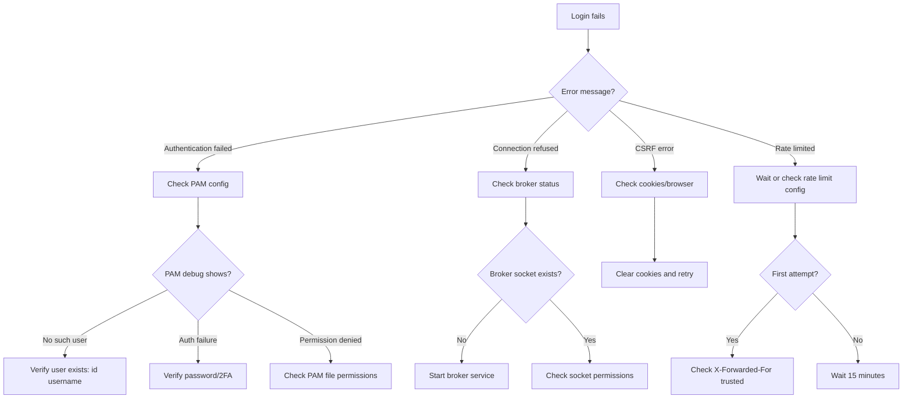
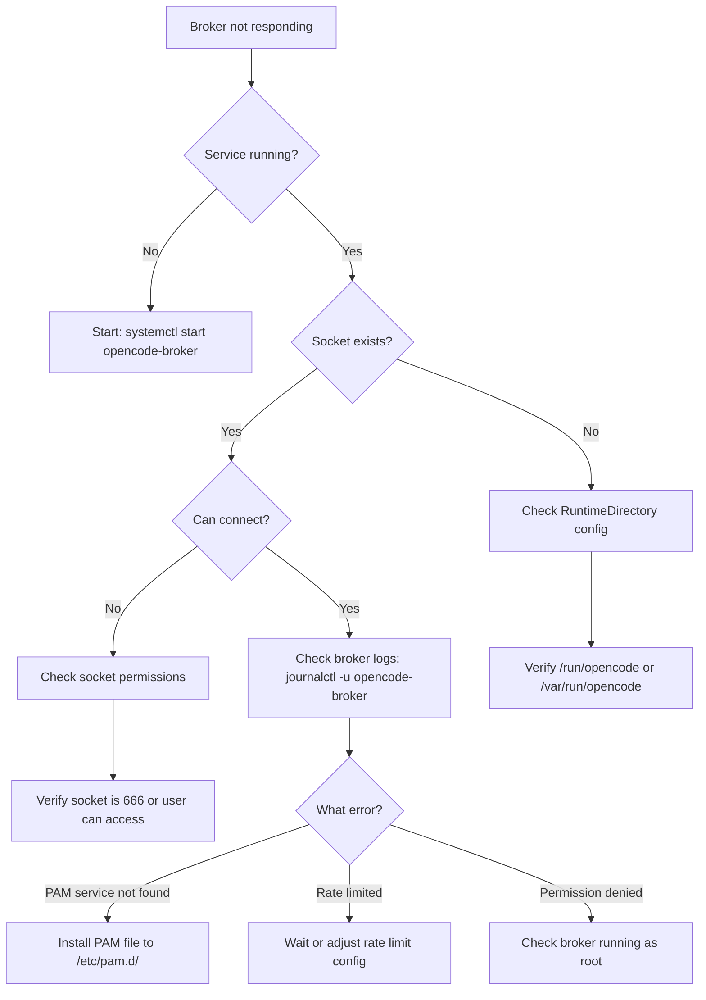
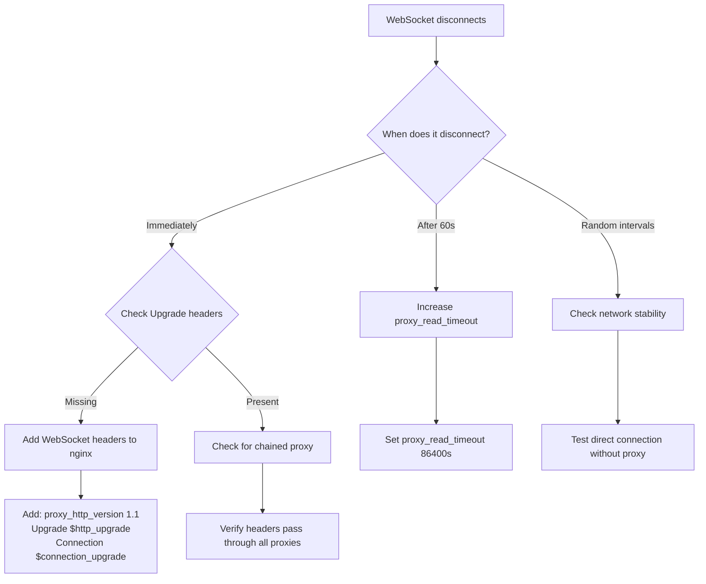

# OpenCode Authentication Troubleshooting

This guide helps you diagnose and resolve authentication issues with OpenCode.

## Table of Contents

- [Overview](#overview)
- [Diagnostic Flowcharts](#diagnostic-flowcharts)
  - [Login Fails](#login-fails-flowchart)
  - [Broker Issues](#broker-issues-flowchart)
  - [WebSocket Issues](#websocket-issues-flowchart)
- [Common Issues](#common-issues)
- [Enabling PAM Debug Logging](#enabling-pam-debug-logging)
- [Checking Broker Status](#checking-broker-status)
- [Getting Help](#getting-help)

## Overview

Authentication issues in OpenCode typically fall into three categories:

1. **Authentication failures** - Credentials rejected, user not found, account locked
2. **Connection issues** - Broker not running, socket permissions, network problems
3. **Configuration issues** - Incorrect PAM setup, missing files, wrong permissions

For detailed PAM configuration instructions, see [pam-config.md](pam-config.md).

### Key Log Locations

**Linux:**

- `/var/log/auth.log` - PAM authentication logs (Debian/Ubuntu)
- `/var/log/secure` - PAM authentication logs (RHEL/CentOS)
- `journalctl -u opencode-broker` - Broker service logs
- `journalctl -u opencode` - OpenCode server logs

**macOS:**

- `/var/log/system.log` - System logs including PAM
- `log show --predicate 'process == "opencode-broker"' --last 1h` - Broker logs
- Console.app - Unified logging viewer

### Systematic Approach

When troubleshooting:

1. **Start with the flowchart** for your symptom
2. **Check logs** at each diagnostic step
3. **Test incrementally** - verify each fix before moving on
4. **Document what worked** - note your configuration for future reference

## Diagnostic Flowcharts

### Login Fails Flowchart



### Broker Issues Flowchart



### WebSocket Issues Flowchart



## Common Issues

### 1. "Authentication failed" - Generic Error

**Symptom:**
Login form shows "Authentication failed" with no specific details.

**Cause:**
PAM authentication failed. By design, OpenCode returns a generic error to prevent user enumeration attacks. The specific reason is logged server-side.

**Debug Steps:**

1. Enable PAM debug logging (see [Enabling PAM Debug Logging](#enabling-pam-debug-logging))

2. Check auth logs while attempting login:

   ```bash
   # Linux (Debian/Ubuntu)
   sudo tail -f /var/log/auth.log

   # Linux (RHEL/CentOS)
   sudo tail -f /var/log/secure

   # macOS
   log stream --predicate 'eventMessage contains "pam"' --level debug
   ```

3. Look for PAM error messages:
   - `pam_unix(opencode:auth): authentication failure; user=username` - Wrong password
   - `pam_unix(opencode:auth): check pass; user unknown` - User doesn't exist
   - `pam_unix(opencode:account): account expired` - Account locked/expired
   - `pam_google_authenticator(opencode:auth): Invalid verification code` - Wrong 2FA code

**Common Causes:**

- **Wrong credentials** - Verify password works with `su - username`
- **User doesn't exist** - Check with `id username`
- **Account locked** - Check with `passwd -S username` (Linux)
- **2FA misconfiguration** - Verify `~/.google_authenticator` file exists if using 2FA
- **PAM service mismatch** - Verify `auth.pam.service` in `opencode.json` matches filename in `/etc/pam.d/`

**Solution:**

Identify the specific PAM error from logs and address accordingly. Most commonly:

- Typo in password → retry with correct password
- User needs to be created → `sudo useradd username` or equivalent
- 2FA not set up → run `google-authenticator` as the user

### 2. "Connection refused" - Broker Not Running

**Symptom:**
Login fails immediately with connection error. Browser console may show network error.

**Cause:**
The `opencode-broker` service is not running or the Unix socket doesn't exist.

**Debug Steps:**

1. Check if broker is running:

   ```bash
   # Linux (systemd)
   systemctl status opencode-broker

   # macOS (launchd)
   sudo launchctl list | grep opencode
   ```

2. Check if socket exists:

   ```bash
   # Linux
   ls -l /run/opencode/auth.sock

   # macOS
   ls -l /var/run/opencode/auth.sock
   ```

3. Check broker logs:

   ```bash
   # Linux
   journalctl -u opencode-broker -n 50

   # macOS
   log show --predicate 'process == "opencode-broker"' --last 1h
   ```

**Common Causes:**

- Broker service not installed
- Broker service failed to start
- Permissions issue creating socket directory
- Wrong socket path configured

**Solution:**

**Linux:**

```bash
# Start broker service
sudo systemctl start opencode-broker

# Enable on boot
sudo systemctl enable opencode-broker

# Verify running
systemctl status opencode-broker

# Check socket created
ls -l /run/opencode/auth.sock
```

**macOS:**

```bash
# Load broker service
sudo launchctl load /Library/LaunchDaemons/com.opencode.broker.plist

# Verify running
sudo launchctl list | grep opencode

# Check socket created
ls -l /var/run/opencode/auth.sock
```

If broker fails to start, check logs for specific error.

### 3. "502 Bad Gateway" - nginx Can't Connect to OpenCode

**Symptom:**
nginx returns `502 Bad Gateway` error when accessing OpenCode.

**Cause:**
nginx cannot reach the OpenCode backend server.

**Debug Steps:**

1. Check nginx error log:

   ```bash
   sudo tail -f /var/log/nginx/error.log
   ```

2. Look for connection errors:
   - `connect() failed (111: Connection refused)` - OpenCode not running
   - `connect() failed (13: Permission denied)` - SELinux blocking nginx

3. Verify OpenCode is running:
   ```bash
   # Check if OpenCode is listening on the configured port
   sudo netstat -tlnp | grep <OPENCODE_PORT>
   # or
   sudo lsof -i :<OPENCODE_PORT>
   ```

**Common Causes:**

- **OpenCode not running** - Start the OpenCode server
- **Wrong port in nginx config** - Verify `proxy_pass` matches OpenCode port
- **SELinux blocking connections** - Allow nginx to make network connections
- **Firewall blocking local connections** - Check iptables/firewalld rules

**Solution:**

**If OpenCode not running:**

```bash
# Start OpenCode server
cd /path/to/opencode
bun run server
```

**If SELinux blocking (RHEL/CentOS/Fedora):**

```bash
# Check if SELinux is enforcing
getenforce

# Check for denials
sudo ausearch -m avc -ts recent | grep httpd

# Allow nginx to make network connections
sudo setsebool -P httpd_can_network_connect 1

# Restart nginx
sudo systemctl restart nginx
```

**If AppArmor blocking (Ubuntu/Debian):**

```bash
# Check AppArmor status
sudo aa-status

# Check for denials
sudo dmesg | grep apparmor | grep nginx

# May need to adjust AppArmor profile at /etc/apparmor.d/
```

### 4. WebSocket Drops After 60 Seconds

**Symptom:**
Terminal or other WebSocket connection disconnects after exactly 60 seconds of inactivity.

**Cause:**
nginx default `proxy_read_timeout` is 60 seconds. WebSocket connections idle longer than this are terminated.

**Debug Steps:**

1. Test if issue is timeout-related:
   - Open terminal
   - Wait 60 seconds without typing
   - Connection drops → timeout issue

2. Check nginx configuration for proxy_read_timeout

**Solution:**

Add to nginx server block or location:

```nginx
location / {
    proxy_pass http://localhost:<OPENCODE_PORT>;

    # Existing WebSocket headers...
    proxy_http_version 1.1;
    proxy_set_header Upgrade $http_upgrade;
    proxy_set_header Connection $connection_upgrade;

    # Increase timeout for WebSocket connections (24 hours)
    proxy_read_timeout 86400s;
    proxy_send_timeout 86400s;
}
```

Reload nginx:

```bash
sudo nginx -t
sudo systemctl reload nginx
```

**Note:** 86400 seconds = 24 hours. Adjust based on your needs.

### 5. Rate Limited When You Shouldn't Be

**Symptom:**
"Too many login attempts" error on first try, or getting rate limited when you haven't made many attempts.

**Cause:**
Rate limiting is IP-based. Multiple users behind the same NAT or proxy may share an IP address, or the wrong IP is being detected.

**Debug Steps:**

1. Check what IP OpenCode sees:
   - Enable debug logging in OpenCode
   - Look for rate limit messages in logs
   - Note the IP address being rate limited

2. Check if behind reverse proxy:
   - Is there an nginx or other proxy?
   - Is `trustProxy` enabled in `opencode.json`?

3. Test with `curl` to see IP detection:
   ```bash
   curl -v http://your-domain.com
   # Look for X-Forwarded-For header
   ```

**Common Causes:**

- **Multiple users sharing NAT IP** - Common in corporate or home networks
- **Proxy not forwarding real IP** - Missing X-Forwarded-For header
- **trustProxy not enabled** - OpenCode sees proxy IP, not client IP
- **Proxy IP not in trusted range** - OpenCode ignores X-Forwarded-For from untrusted proxy

**Solution:**

**If behind reverse proxy:**

1. Ensure nginx (or proxy) sends X-Forwarded-For:

   ```nginx
   proxy_set_header X-Forwarded-For $proxy_add_x_forwarded_for;
   proxy_set_header X-Forwarded-Proto $scheme;
   ```

2. Enable `trustProxy` in `opencode.json`:

   ```json
   {
     "auth": {
       "enabled": true,
       "trustProxy": true
     }
   }
   ```

3. Restart OpenCode server

**If many users behind NAT:**

1. Increase rate limits in `opencode.json`:

   ```json
   {
     "auth": {
       "enabled": true,
       "rateLimitMax": 20,
       "rateLimitWindow": "15m"
     }
   }
   ```

2. Consider per-user rate limiting (future enhancement)

**Temporary workaround - disable rate limiting:**

```json
{
  "auth": {
    "enabled": true,
    "rateLimiting": false
  }
}
```

Note: Only disable rate limiting if behind a trusted reverse proxy that enforces its own limits.

### 6. CSRF Token Error

**Symptom:**
Login form shows "Invalid CSRF token" or "CSRF validation failed" when submitting.

**Cause:**
CSRF cookie not set or doesn't match the form token.

**Debug Steps:**

1. Open browser DevTools → Application/Storage → Cookies
2. Look for `opencode_csrf` cookie
3. Check if cookie is set after page load
4. Try clearing cookies and reload

**Common Causes:**

- **Cookies disabled** - Browser settings or privacy extensions
- **Cookie domain mismatch** - Accessing via different domain than cookie was set for
- **Secure cookie over HTTP** - Cookie requires HTTPS but accessing over HTTP
- **Third-party cookie blocking** - Browser privacy settings

**Solution:**

**Check browser settings:**

- Ensure cookies enabled for the domain
- Disable privacy extensions temporarily (Privacy Badger, uBlock Origin, etc.)
- Try incognito/private mode

**Check OpenCode configuration:**

- If using HTTP locally, `requireHttps` should be `"off"`:
  ```json
  {
    "auth": {
      "requireHttps": "off"
    }
  }
  ```

**For reverse proxy setup:**

- Ensure nginx doesn't strip cookies:
  ```nginx
  # These should be present:
  proxy_set_header Cookie $http_cookie;
  proxy_pass_header Set-Cookie;
  ```

**Clear cookies and retry:**

```javascript
// In browser console
document.cookie.split(";").forEach((c) => {
  document.cookie = c.replace(/^ +/, "").replace(/=.*/, `=;expires=${new Date().toUTCString()};path=/`)
})
location.reload()
```

### 7. 2FA Code Always Invalid

**Symptom:**
TOTP codes from authenticator app are always rejected.

**Cause:**
Time synchronization issue, wrong PAM service configuration, or 2FA not properly set up.

**Debug Steps:**

1. Verify time sync:

   ```bash
   # Check system time
   date

   # Compare with NTP time
   ntpdate -q pool.ntp.org
   ```

2. Check user's 2FA setup:

   ```bash
   # As the user
   ls -l ~/.google_authenticator

   # Verify file exists and readable
   cat ~/.google_authenticator | head -1
   # Should show base32-encoded secret
   ```

3. Check PAM configuration:

   ```bash
   cat /etc/pam.d/opencode-otp
   ```

4. Test 2FA with google-authenticator PAM directly:

   ```bash
   # Install pamtester if not installed
   sudo apt install pamtester  # Debian/Ubuntu

   # Test authentication
   pamtester opencode-otp username authenticate
   ```

**Common Causes:**

- **Time drift** - Server time differs from authenticator app time by >30 seconds
- **Wrong PAM service** - Using `opencode` instead of `opencode-otp` for OTP validation
- **2FA not initialized** - User hasn't run `google-authenticator` command
- **File permissions** - `~/.google_authenticator` not readable

**Solution:**

**Fix time synchronization (Linux):**

```bash
# Install NTP
sudo apt install systemd-timesyncd  # Debian/Ubuntu
sudo yum install chrony              # RHEL/CentOS

# Enable time sync
sudo timedatectl set-ntp true

# Verify synced
timedatectl status
```

**Fix time synchronization (macOS):**

```bash
# Enable automatic time
sudo systemsetup -setusingnetworktime on

# Force sync
sudo sntp -sS time.apple.com
```

**Verify PAM configuration:**

Ensure `/etc/pam.d/opencode-otp` exists and contains:

```
auth       required     pam_google_authenticator.so nullok
account    required     pam_permit.so
```

**Initialize 2FA for user:**

```bash
# Run as the user (not root!)
google-authenticator

# Answer prompts:
# - Time-based tokens: Y
# - Update ~/.google_authenticator: Y
# - Disallow multiple uses: Y
# - Rate limiting: Y
# - Increase window: N (unless time sync issues)
```

**Set correct permissions:**

```bash
chmod 600 ~/.google_authenticator
```

**Verify OpenCode configuration:**

```json
{
  "auth": {
    "enabled": true,
    "twoFactorEnabled": true,
    "pam": {
      "service": "opencode"
    }
  }
}
```

Note: The main PAM service should be `opencode`, not `opencode-otp`. The broker uses `opencode-otp` internally for OTP-only validation.

### 8. SELinux Blocking nginx

**Symptom:**

- nginx returns `502 Bad Gateway`
- nginx error.log shows `(13: Permission denied) while connecting to upstream`
- Happens on RHEL/CentOS/Fedora systems

**Cause:**
SELinux policy prevents `httpd_t` (nginx) from making network connections.

**Debug Steps:**

1. Verify SELinux is enforcing:

   ```bash
   getenforce
   # Output: Enforcing
   ```

2. Check for SELinux denials:

   ```bash
   sudo ausearch -m avc -ts recent | grep httpd
   # or
   sudo grep nginx /var/log/audit/audit.log | grep denied
   ```

3. Look for denials related to `connect`:
   ```
   type=AVC msg=audit(...): avc: denied { name_connect } for pid=... comm="nginx"
   dest=<OPENCODE_PORT> scontext=system_u:system_r:httpd_t:s0
   tcontext=system_u:object_r:unreserved_port_t:s0 tclass=tcp_socket permissive=0
   ```

**Solution:**

**Option 1: Allow httpd network connect (recommended):**

```bash
# Allow nginx to make network connections
sudo setsebool -P httpd_can_network_connect 1

# Verify setting
getsebool httpd_can_network_connect
# Output: httpd_can_network_connect --> on
```

**Option 2: Label OpenCode port:**

```bash
# If OpenCode runs on non-standard port, label it as http_port_t
sudo semanage port -a -t http_port_t -p tcp <OPENCODE_PORT>

# Verify
sudo semanage port -l | grep http_port_t
```

**Option 3: Create custom policy (advanced):**

```bash
# Generate policy from denials
sudo ausearch -m avc -ts recent | audit2allow -M opencode-nginx

# Review the policy
cat opencode-nginx.te

# Install policy if it looks correct
sudo semodule -i opencode-nginx.pp
```

**Option 4: Disable SELinux (NOT recommended for production):**

```bash
# Temporary (until reboot)
sudo setenforce 0

# Permanent (edit /etc/selinux/config)
sudo sed -i 's/SELINUX=enforcing/SELINUX=permissive/' /etc/selinux/config
```

**After applying fix:**

```bash
# Restart nginx
sudo systemctl restart nginx

# Test connection
curl http://localhost
```

### 9. macOS PAM "Operation not permitted"

**Symptom:**
On macOS Monterey (12.x) or later, PAM operations fail with "Operation not permitted" errors in logs.

**Cause:**
macOS Transparency, Consent, and Control (TCC) restrictions prevent processes from accessing `/etc/pam.d/` without full disk access.

**Debug Steps:**

1. Check macOS version:

   ```bash
   sw_vers
   # ProductVersion: 12.x or later = TCC restrictions apply
   ```

2. Check system logs:

   ```bash
   log show --predicate 'eventMessage contains "pam"' --last 1h | grep denied
   ```

3. Check if broker has full disk access:
   - System Preferences → Security & Privacy → Privacy → Full Disk Access
   - Look for Terminal or the app running opencode-broker

**Common Causes:**

- **TCC restrictions** - macOS 12+ restricts PAM operations
- **Broker not granted Full Disk Access** - Process needs explicit permission
- **SIP (System Integrity Protection)** - Protects system files

**Solution:**

**Option 1: Grant Full Disk Access (recommended):**

1. Open System Preferences → Security & Privacy → Privacy
2. Select "Full Disk Access" in left sidebar
3. Click lock icon to make changes
4. Add the terminal app or process running opencode-broker:
   - For Terminal: `/Applications/Utilities/Terminal.app`
   - For iTerm2: `/Applications/iTerm.app`
   - For systemwide: `/usr/local/bin/opencode-broker`

5. Restart the broker process

**Option 2: Run broker from authorized location:**

macOS allows certain system locations to access PAM. Install broker to:

```bash
# System binary location
sudo cp opencode-broker /usr/local/bin/
sudo chown root:wheel /usr/local/bin/opencode-broker
sudo chmod 755 /usr/local/bin/opencode-broker

# Update launchd plist ProgramArguments path
sudo nano /Library/LaunchDaemons/com.opencode.broker.plist
# Set: <string>/usr/local/bin/opencode-broker</string>

# Reload launchd
sudo launchctl unload /Library/LaunchDaemons/com.opencode.broker.plist
sudo launchctl load /Library/LaunchDaemons/com.opencode.broker.plist
```

**Option 3: Disable SIP (NOT recommended):**

SIP protects critical system files. Only disable if absolutely necessary and you understand the risks.

```bash
# Reboot into Recovery Mode (hold Cmd+R during boot)
# Open Terminal from Utilities menu
csrutil disable
# Reboot normally
```

**After applying fix:**

```bash
# Verify broker running
sudo launchctl list | grep opencode

# Test authentication
# Try logging in via OpenCode web UI
```

**Note:** System updates may reset TCC permissions or `/etc/pam.d/` files. Re-verify after major macOS updates.

## Enabling PAM Debug Logging

PAM debug logging reveals detailed authentication flow, including which modules are called and why authentication fails.

### Linux (systemd systems)

**1. Add debug flag to PAM configuration:**

Edit `/etc/pam.d/opencode`:

```bash
sudo nano /etc/pam.d/opencode
```

Add `debug` parameter to relevant lines:

```
# Before (no debug):
auth       required     pam_unix.so

# After (with debug):
auth       required     pam_unix.so debug
```

For 2FA debugging, edit `/etc/pam.d/opencode-otp`:

```
auth       required     pam_google_authenticator.so nullok debug
```

**2. Configure rsyslog for auth logging:**

Edit `/etc/rsyslog.conf` or `/etc/rsyslog.d/50-default.conf`:

```bash
sudo nano /etc/rsyslog.d/50-default.conf
```

Ensure auth logging enabled:

```
# Log auth messages to /var/log/auth.log
auth,authpriv.*                 /var/log/auth.log
```

**3. Disable rsyslog rate limiting (optional):**

rsyslog may rate-limit repeated messages. To see all messages:

Create `/etc/rsyslog.d/00-disable-ratelimit.conf`:

```bash
sudo nano /etc/rsyslog.d/00-disable-ratelimit.conf
```

Add:

```
# Disable rate limiting for auth messages
$SystemLogRateLimitInterval 0
$SystemLogRateLimitBurst 0
```

**4. Restart services:**

```bash
sudo systemctl restart rsyslog
```

**5. Watch logs during login attempt:**

```bash
# Debian/Ubuntu
sudo tail -f /var/log/auth.log

# RHEL/CentOS
sudo tail -f /var/log/secure
```

### macOS

**1. Add debug flag to PAM configuration:**

Edit `/etc/pam.d/opencode`:

```bash
sudo nano /etc/pam.d/opencode
```

Add `debug` parameter:

```
# Before:
auth       required     pam_opendirectory.so

# After:
auth       required     pam_opendirectory.so debug
```

**2. Enable PAM debug logging:**

macOS logs PAM messages to unified logging system. No additional configuration needed.

**3. Watch logs during login attempt:**

```bash
# Stream PAM-related logs
log stream --predicate 'eventMessage contains "pam"' --level debug

# Or filter for specific process
log stream --predicate 'process == "opencode-broker"' --level debug

# Or use Console.app GUI
open -a Console
# Filter by "pam" or "opencode-broker"
```

**4. Show recent PAM logs:**

```bash
log show --predicate 'eventMessage contains "pam"' --last 1h --info --debug
```

### Example Debug Output

**Successful authentication:**

```
pam_unix(opencode:auth): authentication success; user=johndoe
pam_unix(opencode:account): account valid
```

**Failed authentication (wrong password):**

```
pam_unix(opencode:auth): authentication failure; user=johndoe
pam_unix(opencode:auth): 1 authentication failure; user=johndoe
```

**Failed authentication (no such user):**

```
pam_unix(opencode:auth): check pass; user unknown
```

**2FA failure:**

```
pam_google_authenticator(opencode-otp:auth): Invalid verification code for johndoe
```

**Account locked:**

```
pam_unix(opencode:account): account johndoe has expired (account expired)
```

### Removing Debug Logging

After troubleshooting, remove `debug` parameter from PAM files:

```bash
sudo nano /etc/pam.d/opencode
# Remove "debug" from each line

sudo systemctl restart rsyslog  # Linux only
```

Debug logging can be verbose and may impact performance. Enable only when troubleshooting.

## Checking Broker Status

### Linux (systemd)

**Check if running:**

```bash
systemctl status opencode-broker
```

Look for:

- `Active: active (running)` - Broker is running
- `Active: inactive (dead)` - Broker stopped
- `Active: failed` - Broker crashed

**Check logs:**

```bash
# Recent logs
journalctl -u opencode-broker -n 50

# Follow logs live
journalctl -u opencode-broker -f

# Logs since last boot
journalctl -u opencode-broker -b

# Logs with timestamps
journalctl -u opencode-broker -o short-precise
```

**Verify socket:**

```bash
# Check socket exists
ls -l /run/opencode/auth.sock

# Expected output:
srw-rw-rw- 1 root root 0 Jan 25 12:00 /run/opencode/auth.sock
```

**Start/stop broker:**

```bash
# Start
sudo systemctl start opencode-broker

# Stop
sudo systemctl stop opencode-broker

# Restart
sudo systemctl restart opencode-broker

# Enable on boot
sudo systemctl enable opencode-broker

# Disable on boot
sudo systemctl disable opencode-broker
```

**Check resource usage:**

```bash
systemctl status opencode-broker | grep -E "Memory|CPU"
```

### macOS (launchd)

**Check if running:**

```bash
sudo launchctl list | grep opencode
```

Output format: `PID  Status  Label`

- PID shown → Running
- `-` for PID → Not running

**Check detailed status:**

```bash
sudo launchctl print system/com.opencode.broker
```

**Check logs:**

```bash
# Using log command
log show --predicate 'process == "opencode-broker"' --last 1h

# Follow logs live
log stream --predicate 'process == "opencode-broker"'

# Using Console.app
open -a Console
# Filter by "opencode-broker"
```

**Verify socket:**

```bash
# Check socket exists
ls -l /var/run/opencode/auth.sock

# Expected output:
srw-rw-rw-  1 root  wheel  0 Jan 25 12:00 /var/run/opencode/auth.sock
```

**Start/stop broker:**

```bash
# Load (start) broker
sudo launchctl load /Library/LaunchDaemons/com.opencode.broker.plist

# Unload (stop) broker
sudo launchctl unload /Library/LaunchDaemons/com.opencode.broker.plist

# Reload configuration
sudo launchctl unload /Library/LaunchDaemons/com.opencode.broker.plist
sudo launchctl load /Library/LaunchDaemons/com.opencode.broker.plist
```

**Check resource usage:**

```bash
ps aux | grep opencode-broker
```

### Socket Connection Test

Test if you can connect to the broker socket:

```bash
# Using netcat (if socket is TCP)
nc -U /run/opencode/auth.sock  # Linux
nc -U /var/run/opencode/auth.sock  # macOS

# Using socat
echo '{"jsonrpc":"2.0","method":"ping","id":1}' | socat - UNIX-CONNECT:/run/opencode/auth.sock
```

If connection succeeds, broker is listening. If `Connection refused`, broker not running or socket doesn't exist.

### Common Broker Startup Issues

**Issue: RuntimeDirectory not created**

**Symptom:**

```
Error: No such file or directory (os error 2)
Failed to bind to /run/opencode/auth.sock
```

**Solution (Linux):**

```bash
# Manually create directory
sudo mkdir -p /run/opencode
sudo chmod 755 /run/opencode

# Or fix systemd service
sudo nano /etc/systemd/system/opencode-broker.service
# Ensure: RuntimeDirectory=opencode

sudo systemctl daemon-reload
sudo systemctl restart opencode-broker
```

**Solution (macOS):**

```bash
# Manually create directory
sudo mkdir -p /var/run/opencode
sudo chmod 755 /var/run/opencode

# Restart broker
sudo launchctl unload /Library/LaunchDaemons/com.opencode.broker.plist
sudo launchctl load /Library/LaunchDaemons/com.opencode.broker.plist
```

**Issue: PAM service not found**

**Symptom:**

```
Error: PAM service 'opencode' not found
```

**Solution:**

```bash
# Verify PAM file exists
ls -l /etc/pam.d/opencode

# If missing, install from source
sudo cp /path/to/opencode/packages/opencode-broker/service/opencode.pam /etc/pam.d/opencode
sudo chmod 644 /etc/pam.d/opencode

# Restart broker
sudo systemctl restart opencode-broker  # Linux
sudo launchctl unload /Library/LaunchDaemons/com.opencode.broker.plist && \
sudo launchctl load /Library/LaunchDaemons/com.opencode.broker.plist  # macOS
```

**Issue: Permission denied binding socket**

**Symptom:**

```
Error: Permission denied (os error 13)
Failed to bind to /run/opencode/auth.sock
```

**Solution:**

```bash
# Ensure broker runs as root
# Check systemd service (Linux)
sudo systemctl cat opencode-broker | grep User
# Should NOT have User= line (defaults to root)

# Check launchd plist (macOS)
grep -A1 UserName /Library/LaunchDaemons/com.opencode.broker.plist
# Should have <key>UserName</key><string>root</string>

# Or check existing socket ownership
ls -l /run/opencode/auth.sock
# Should be owned by root, or writable by broker user
```

## Getting Help

If you've followed the troubleshooting steps and still experiencing issues, we're here to help.

### Before Reporting an Issue

Please gather the following information:

1. **Platform details:**

   ```bash
   # Linux
   uname -a
   lsb_release -a  # or cat /etc/os-release

   # macOS
   sw_vers
   ```

2. **OpenCode version:**

   ```bash
   cd /path/to/opencode
   git describe --tags
   # or
   cat package.json | grep version
   ```

3. **Broker status and logs:**

   ```bash
   # Linux
   systemctl status opencode-broker
   journalctl -u opencode-broker -n 100 --no-pager

   # macOS
   sudo launchctl list | grep opencode
   log show --predicate 'process == "opencode-broker"' --last 1h
   ```

4. **PAM configuration:**

   ```bash
   cat /etc/pam.d/opencode
   cat /etc/pam.d/opencode-otp
   ```

5. **OpenCode configuration (REDACT SENSITIVE DATA):**

   ```bash
   cat opencode.json | jq '.auth'
   # Remove any sensitive values before sharing
   ```

6. **Authentication logs with debug enabled:**

   ```bash
   # Follow steps in "Enabling PAM Debug Logging"
   # Capture output during failed login attempt
   ```

7. **Symptoms:**
   - Exact error message shown to user
   - When the issue started
   - What changed before the issue started
   - Whether it affects all users or specific users

### Where to Get Help

**GitHub Issues (for bugs):**

- [OpenCode Issues](https://github.com/opencode-ai/opencode/issues)
- Search existing issues first
- Use "auth:" prefix in issue title
- Include all information from "Before Reporting" above

**GitHub Discussions (for questions):**

- [OpenCode Discussions](https://github.com/opencode-ai/opencode/discussions)
- For configuration questions, deployment advice
- Check Q&A category first

**Related Projects:**

- [opencode-cloud](https://github.com/pRizz/opencode-cloud) - For systemd service management issues

### What NOT to Share Publicly

When reporting issues, do NOT include:

- Passwords, API keys, tokens
- Real usernames (use "user1", "testuser" examples)
- Internal hostnames or IP addresses
- Full paths that reveal internal structure
- Contents of `~/.google_authenticator` files

Redact sensitive data from logs and configuration before posting publicly.
